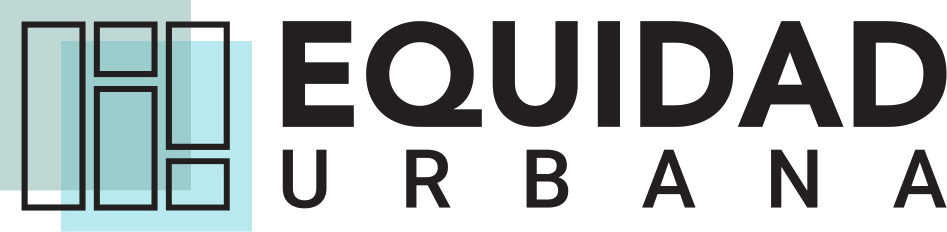

```{=html}
<style>
@import url('https://fonts.googleapis.com/css2?family=Archivo:wght@400;500;600;700&family=Newsreader:opsz,wght@6..72,500;6..72,600;6..72,700&display=swap');

body:has(.eu-propuesta) .navbar,
body:has(.eu-propuesta) #quarto-header { display:none; }
body:has(.eu-propuesta) #quarto-content,
body:has(.eu-propuesta) #quarto-document-content { margin:0; padding:0; max-width:none; width:100%; }

.eu-propuesta { --azul:#123d4a; --azul-medio:#1f5a68; --crema:#f5f1e9; --arena:#e8dfce; --coral:#c76d4c; --verde:#78958c; --tinta:#173a43; width:100vw; min-height:100vh; margin-left:calc(50% - 50vw); background:var(--crema); color:var(--tinta); font-family:Archivo,Arial,sans-serif; }
.eu-barra { display:flex; align-items:center; justify-content:space-between; gap:2rem; min-height:78px; padding:0 clamp(1.3rem,5vw,5.5rem); background:#fff; border-bottom:1px solid #e3ded5; }
.eu-marca { display:flex; align-items:center; gap:1rem; color:var(--azul); font-size:.82rem; font-weight:700; letter-spacing:.1em; text-decoration:none; text-transform:uppercase; white-space:nowrap; }
.eu-marca img { width:145px; max-height:42px; object-fit:contain; object-position:left center; }
.eu-navegacion { display:flex; align-items:center; justify-content:flex-end; flex-wrap:wrap; gap:1.4rem; }
.eu-navegacion a { color:#466267 !important; font-size:.82rem; font-weight:600; text-decoration:none !important; }.eu-navegacion a:first-child { color:var(--azul) !important; }
.eu-etiqueta { margin:0; color:#f5cf92; font-size:.73rem; font-weight:700; letter-spacing:.14em; text-transform:uppercase; }
.eu-hero { position:relative; display:flex; align-items:center; min-height:min(51vh,500px); padding:clamp(1.8rem,5vw,4.5rem); background:linear-gradient(90deg,rgba(12,47,56,.91) 0%,rgba(12,47,56,.62) 48%,rgba(12,47,56,.08) 82%),url('assets/comunidad-portada.jpg') center 54%/cover; color:#fff; }
.eu-hero-contenido { max-width:710px; transform:translateY(7%); }.eu-hero h1 { margin:.65rem 0 .9rem; color:#fff; font-family:Newsreader,Georgia,serif; font-size:clamp(2.35rem,4.65vw,4.25rem); font-weight:600; letter-spacing:-.055em; line-height:.94; }.eu-hero p { max-width:610px; margin:0; color:#f5f8f6; font-size:clamp(.9rem,1.25vw,1rem); line-height:1.55; }.eu-explora { margin-top:1rem !important; color:#f5cf92 !important; font-size:.88rem !important; font-weight:700; letter-spacing:.01em; }.eu-encuesta { display:inline-flex; align-items:center; gap:.55rem; margin-top:1.1rem; padding:.66rem .95rem; border:1px solid rgba(255,255,255,.85); border-radius:999px; background:#fff; color:var(--azul) !important; font-size:.86rem; font-weight:700; text-decoration:none !important; }.eu-encuesta:hover { background:#f5cf92; border-color:#f5cf92; color:var(--azul) !important; }
.eu-secciones { padding:clamp(3rem,6vw,5rem) clamp(1.3rem,9vw,9rem) clamp(4rem,8vw,7rem); background:#fff; }.eu-secciones-cabecera { margin-bottom:1.5rem; }.eu-secciones h2 { margin:0; color:var(--azul); font-family:Newsreader,Georgia,serif; font-size:clamp(2rem,3.5vw,3.3rem); font-weight:600; letter-spacing:-.04em; }
.eu-cuadricula { display:grid; grid-template-columns:repeat(2,minmax(0,1fr)); gap:1rem; max-width:1040px; margin:0 auto; }.eu-tarjeta { position:relative; display:flex; flex-direction:column; justify-content:space-between; aspect-ratio:1.6/1; min-height:210px; padding:clamp(1.25rem,2.7vw,2.1rem); border:1px solid rgba(18,61,74,.28); color:var(--azul) !important; text-decoration:none !important; overflow:hidden; transition:transform .2s ease,box-shadow .2s ease,background .2s ease; background:#dce9e6; }.eu-tarjeta:hover { transform:translateY(-4px); background:#cadfda; box-shadow:0 15px 32px rgba(31,68,72,.12); }.eu-tarjeta:nth-child(5) { grid-column:1 / -1; width:calc(50% - .5rem); justify-self:center; }.eu-numero { color:var(--coral); font-family:Newsreader,Georgia,serif; font-size:1.1rem; font-weight:700; }.eu-tarjeta h3 { max-width:430px; margin:auto 0 .6rem; font-family:Newsreader,Georgia,serif; font-size:clamp(1.8rem,3vw,2.85rem); font-weight:600; letter-spacing:-.045em; line-height:.98; }.eu-tarjeta p { max-width:450px; margin:0; color:#456068; font-size:.92rem; line-height:1.5; }.eu-flecha { align-self:flex-end; margin-top:1rem; color:var(--coral); font-size:1.45rem; }
body:has(.eu-propuesta) .page-footer .nav-footer, body:has(.eu-propuesta) footer.footer .nav-footer { padding-left:clamp(1.3rem,5vw,5.5rem); padding-right:clamp(1.3rem,5vw,5.5rem); }
@media (max-width:850px) { .eu-barra { padding:1rem 1.3rem; }.eu-navegacion { display:none; }.eu-hero { min-height:500px; padding:2rem 1.4rem; background-position:54% center; }.eu-secciones { padding:3.5rem 1.4rem 4rem; }.eu-cuadricula { gap:.75rem; }.eu-tarjeta { min-height:200px; padding:1.35rem; } }
@media (max-width:560px) { .eu-marca img { width:125px; }.eu-cuadricula { grid-template-columns:1fr; }.eu-tarjeta, .eu-tarjeta:nth-child(5) { width:auto; aspect-ratio:auto; min-height:215px; }.eu-hero h1 { font-size:3.2rem; } }
</style>

<main class="eu-propuesta" aria-label="Propuesta de estilo visual general">
  <header class="eu-barra">
    <a class="eu-marca" href="index.html"></a>
    <nav class="eu-navegacion" aria-label="Navegación de muestra"><a href="index.html">🏠 Inicio</a><a href="Mapa/prueba_mapgl.html">🗺️ Redes</a><a href="biblioteca.html">📚 Biblioteca</a><a href="preguntas_frecuentes.html">❓ Preguntas</a><a href="noticias.html">📅 Fondos</a><a href="proyectos_ds19.html">🏘️ Proyectos DS19</a></nav>
  </header>

  <section class="eu-hero">
    <div class="eu-hero-contenido">
      <p class="eu-etiqueta">Equidad-comunidades</p>
      <h1>Plataforma informativa para comunidades organizadas.</h1>
      <p>Si eres parte de un conjunto habitacional DS19, este es tu lugar. Encuentra información normativa, resuelve tus dudas, conoce las redes de tu sector y entérate de fondos y beneficios disponibles.</p>
      <a class="eu-encuesta" href="https://docs.google.com/forms/d/1OjtGpLEtfJ360bCI90LOX2r84r2vm2JamWJPGIObyoI/viewform" target="_blank" rel="noopener">💬 Cuéntanos qué te pareció la página: responde la encuesta de satisfacción</a>
    </div>
  </section>

  <section class="eu-secciones">
    <div class="eu-secciones-cabecera"><h2>Comienza a utilizar Equidad-comunidades aquí</h2></div>
    <div class="eu-cuadricula">
      <a class="eu-tarjeta" href="Mapa/prueba_mapgl.html"><span class="eu-numero">01</span><div><h3>🗺️ Explora el territorio</h3><p>Busca tu comuna y revisa las redes, equipamientos y proyectos disponibles en el sector. Encuentra los números telefónicos y páginas web de diferentes organismos públicos.</p></div><span class="eu-flecha">→</span></a>
      <a class="eu-tarjeta" href="biblioteca.html"><span class="eu-numero">02</span><div><h3>📚 Biblioteca</h3><p>Accede a leyes, manuales y documentos útiles en materia de vivienda y barrio.</p></div><span class="eu-flecha">→</span></a>
      <a class="eu-tarjeta" href="preguntas_frecuentes.html"><span class="eu-numero">03</span><div><h3>🤖 Preguntas y respuestas frecuentes</h3><p>Revisa respuestas a preguntas frecuentes sobre copropiedad, uso, cuidado y mantención de las viviendas, derechos, deberes y organización comunitaria.</p></div><span class="eu-flecha">→</span></a>
      <a class="eu-tarjeta" href="noticias.html"><span class="eu-numero">04</span><div><h3>📝 Fondos públicos y noticias de interés</h3><p>Busca fondos, concursos y llamados a subsidios, y accede directamente a sus portales de postulación e información. Encuentra noticias relacionadas con tu comuna o región.</p></div><span class="eu-flecha">→</span></a>
      <a class="eu-tarjeta" href="proyectos_ds19.html"><span class="eu-numero">05</span><div><h3>🏘️ Proyectos DS19</h3><p>Busca tu proyecto o comuna para conocer las próximas actividades del PIS, sus fechas, horarios, lugar de reunión y email de contacto.</p></div><span class="eu-flecha">→</span></a>
    </div>
  </section>

</main>
```
